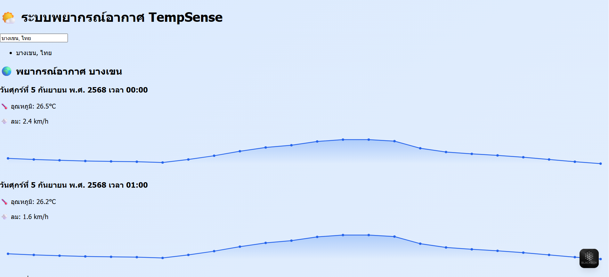

# TempSense

TempSense คือเว็บแอปพลิเคชันพยากรณ์อากาศที่พัฒนาโดยใช้ React, Tailwind CSS และ Open-Meteo API เพื่อให้ผู้ใช้สามารถดูข้อมูลสภาพอากาศในพื้นที่ต่าง ๆ ได้

## ฟีเจอร์หลัก

- ค้นหาสถานที่โดยใช้ชื่อเมือง
- แสดงข้อมูลพยากรณ์อากาศรายชั่วโมง
- แสดงกราฟอุณหภูมิแบบ Mini Line Chart

## เทคโนโลยีที่ใช้

- React
- Tailwind CSS
- Open-Meteo API
- Render สำหรับการ Deploy

